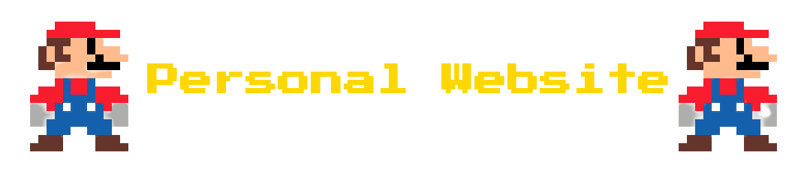

## Personal Website & Micro blog
This repository contains my personal website, the aim for its existance is to have a personal website that acts as CV and a small blog, which it can be used to share technical articles with the world.

This app contains the following features:

- [x] Front-end area for end users.
- [x] Micro blog for quick articles.
- [x] Administration back-end for managing site content. 
- [x] admin dashboard.
- [x] Ability to to globaly put site on maintenance mode for future updates with nice message for end users.

## Stack used to built this web app.

This web app is built with the following stack:

- Laravel framework v8.
- Frontend built using both 8bit NES CSS framework & bootstrap 4 CSS framework.
- Vanilla javascript & jQuery for app interactions & Ajax requests.

## System requirements.

To deploy this app make sure that PHP >= 7.3 is installed on your server.

## PHP extended coding style.

PHP PSR-12 coding style have been followed in nearly all codebase.

## License

This web application is open-sourced software licensed under the [MIT license](https://opensource.org/licenses/MIT).